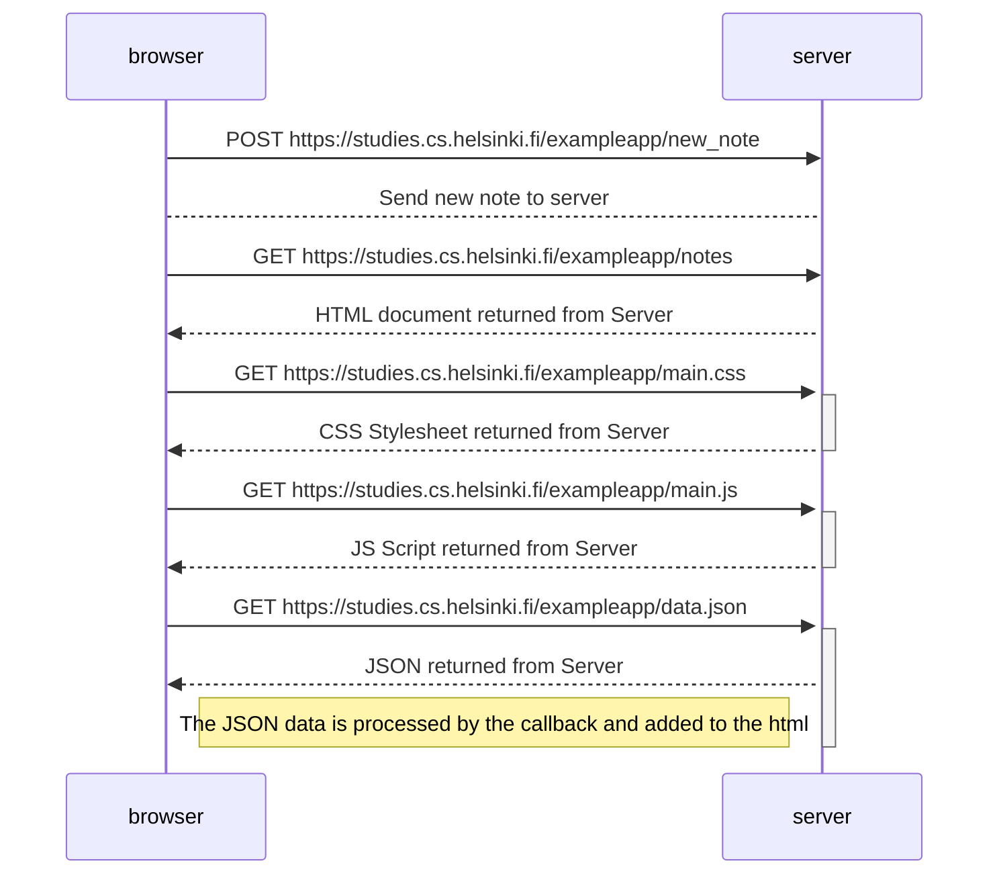

## New note diagram

```mermaid

sequenceDiagram

participant browser

participant server

  

browser->>server: POST https://studies.cs.helsinki.fi/exampleapp/new_note
browser-->server: Send new note to server

browser->>server: GET https://studies.cs.helsinki.fi/exampleapp/notes

activate server
server-->>browser: HTML document returned from Server

browser->>server: GET https://studies.cs.helsinki.fi/exampleapp/main.css

activate server

server-->>browser: CSS Stylesheet returned from Server

deactivate server

  

browser->>server: GET https://studies.cs.helsinki.fi/exampleapp/main.js

activate server

server-->>browser: JS Script returned from Server

deactivate server


browser->>server: GET https://studies.cs.helsinki.fi/exampleapp/data.json

activate server

server-->>browser: JSON returned from Server

Note right of browser: The JSON data is processed by the callback and added to the html

deactivate server

```
