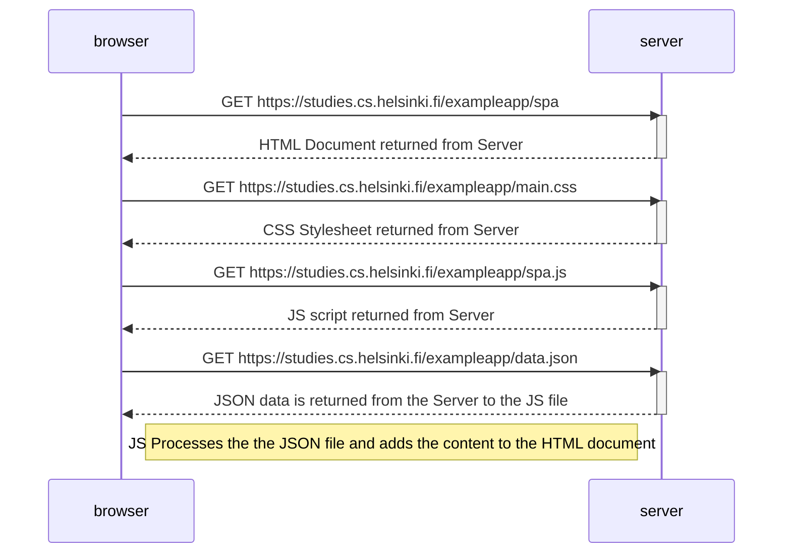

## Single page app diagram

```mermaid

sequenceDiagram

participant browser

participant server

  

browser->>server: GET https://studies.cs.helsinki.fi/exampleapp/spa

activate server

server-->>browser: HTML Document returned from Server

deactivate server

browser->>server: GET https://studies.cs.helsinki.fi/exampleapp/main.css

activate server

server-->>browser: CSS Stylesheet returned from Server

deactivate server

  

browser->>server: GET https://studies.cs.helsinki.fi/exampleapp/spa.js

activate server

server-->>browser: JS script returned from Server

deactivate server


browser->>server: GET https://studies.cs.helsinki.fi/exampleapp/data.json

activate server

server-->>browser: JSON data is returned from the Server to the JS file

deactivate server

Note right of browser: JS Processes the the JSON file and adds the content to the HTML document

```
